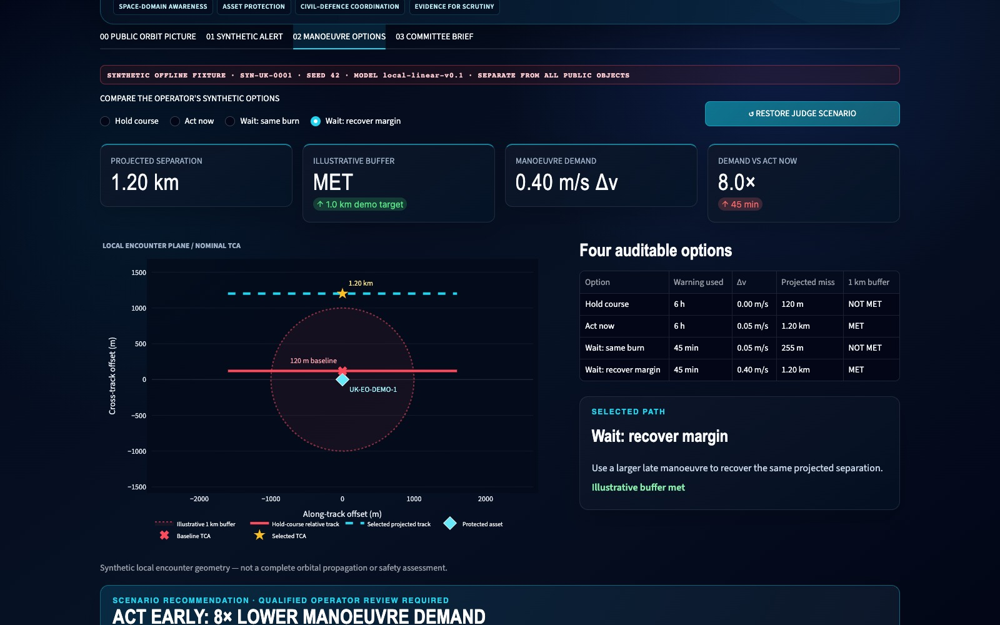

# UK Orbit Guard

> **Conjunction-to-Committee:** turn public orbital context, a transparent
> synthetic encounter, and verifiable remote policy training into questions
> Parliament can scrutinise.

UK Orbit Guard is a UK Parliament hackathon prototype for defensive space
resilience. Its command-centre view deliberately keeps three things separate:

1. a dated **public CelesTrak debris field** for scale and catalogue context;
2. a **synthetic local encounter** around the fictional controlled satellite
   `GUARD-1`; and
3. a **Daytona-hosted synthetic policy-search run**, when the Daytona SDK and a
   user-supplied credential are available.

The public catalogue is never used as the RL scenario or asserted to contain a
conjunction. The RL output is never a flight plan. The interface states the
boundary throughout:

> **PUBLIC-DATA PROTOTYPE · NO RESTRICTED FEEDS · NO COMMAND · NOT FOR FLIGHT OPERATIONS**

No endorsement, ownership, operational use or system connection by Parliament,
the RAF, MOD, the National Space Operations Centre (NSpOC), the UK Space Agency
(UKSA), the Civil Aviation Authority (CAA), CelesTrak or any satellite operator
is claimed.



*Manoeuvre Options screen from the committed fallback pack, captured on the earlier four-tab build (commit a5cae17) before 00 SPACE COMMAND was added and tabs were renumbered; all values come from the fictional, synthetic SYN-UK-0001 fixture.*

## System architecture


*Purple: model call · blue: deterministic code · green: human · amber: evaluation · grey: storage · dashed: external, optional, mocked or planned*

The Streamlit app starts offline: public CelesTrak GP/OMM records come from a
committed dated snapshot or local cache, are propagated with SGP4 for display
only, and are fetched from the network only when the presenter presses a
refresh control. The presenter injects synthetic Hill-frame objects, the app
replays a local, untrained Gen 0 `COAST` episode, and **TRAIN** hands a frozen
request to a background controller that runs cross-entropy-method (CEM) policy
search in a private, network-blocked Daytona sandbox. The host re-hashes and
re-simulates every returned checkpoint before writing a verified result under
`.cache/daytona_rl/` for the generation replay and run passport, while a
separate fictional lead-time fixture drives tabs 02–04. The text diagram and
key-file list are in [Architecture](#architecture) below.

## How AI is used

- **Model:** a learned policy, not an LLM. `hill-cem-v1` is a linear policy
  (5 thrust actions × 13 inputs = 65 weights, argmax action) trained by CEM in
  `rl_core.train_policy`: 10 generations × 24 candidates × 3 perturbed
  episodes = 720 search episodes, seed 42.
- **Inputs:** a 12-feature observation from the synthetic encounter only (own
  state, nearest-object relative state, closest-approach time/miss, object
  count, episode progress). Public CelesTrak data never reaches the policy.
- **Where it is trained:** only in an optional Daytona sandbox (needs
  `daytona==0.207.0` and `DAYTONA_API_KEY`). The host re-simulates returned
  checkpoints for validation but never trains locally; without the sandbox the
  app shows only the deterministic Gen 0 baseline.
- **Outputs:** per-generation weights, checkpoint hashes and trajectories,
  shown as a replay and training curve. They are thrust choices in a teaching
  model, never a manoeuvre recommendation, flight plan or spacecraft command.
- **Deterministic or human-controlled:** SGP4 display, the 8× lead-time
  fixture, committee brief and validation are deterministic code; the
  presenter chooses whether to inject, train or load a replay, and real
  decisions stay with humans (see [Hard stop](#hard-stop-before-any-real-decision)).
- **Evaluation:** the host re-runs the baseline, trained and every generation
  checkpoint with `simulate_policy` and rejects mismatched sandbox, scenario,
  runtime or checkpoint evidence (see
  [Honest Daytona evidence contract](#honest-daytona-evidence-contract));
  `pytest` and `python -m orbit_guard.demo --check` run in CI.
- **Limitations:** a planar Hill/LVLH model around an illustrative 550 km orbit
  with a 0.35 km keep-out radius. Educational, not operational.

## What is new in the command centre

The first tab, **00 SPACE COMMAND**, is the stage surface:

- a 3D Earth shows the committed snapshot's **2,661 public GP/OMM records**
  returned by three CelesTrak debris-event group queries;
- the injection console adds only deterministic synthetic `head-on`,
  `crossing` or `fast debris` encounter templates;
- generation 0 is a local, untrained `COAST` baseline;
- **TRAIN GEN 0 → 10 ON DAYTONA** launches the frozen synthetic job only when
  the host SDK and `DAYTONA_API_KEY` are present;
- a validated result unlocks the generation rail, training curve, trajectory
  replay and a run passport; and
- **LOAD LAST VERIFIED REPLAY** can load a prior host-validated result, but the
  ribbon identifies it as recorded and not current live compute.

At the fixed demo settings the remote worker performs cross-entropy episodic
policy search over 10 generations, 24 candidate policies and 3 perturbed
episodes per candidate: **720 search episodes**, plus deterministic validation
replays. It uses a 12-feature observation, five discrete thrust actions and a
planar Hill/LVLH teaching model around an illustrative 550 km circular reference
orbit. This is a compact educational RL problem, not operational astrodynamics.

The repository and local tests do **not** prove that a live Daytona run has
occurred. A run may be described as live only while the UI reports active
Daytona phases for that invocation. A completed run may be described as a
verified Daytona result only when the UI shows its validated run passport,
including a real sandbox ID, matching scenario and runtime hashes, changed
checkpoint, collected result and confirmed sandbox deletion.

## Public data and synthetic data are different evidence classes

| Surface | Input | Responsible interpretation |
|---|---|---|
| **Command-centre debris globe** | Committed 3 September 2026 snapshot with 2,661 unique CelesTrak GP/OMM records: 1,963 from the FENGYUN-1C-DEBRIS query, 111 from IRIDIUM-33-DEBRIS and 587 from COSMOS-2251-DEBRIS | Public mean-element context propagated with SGP4 for display. Each group result includes its named parent object as well as debris records. This is not a complete catalogue, sensor picture, local conjunction screen or safety assessment. Counts may differ after a later validated refresh. |
| **Command-centre RL encounter** | One to six deterministic synthetic objects created by the injection buttons | Fictional planar Hill/LVLH training geometry. No public object, public orbit or SOCRATES row becomes training truth. |
| **Daytona result** | The frozen synthetic encounter, model code and training request | Remote policy-search evidence only. It does not calculate collision probability, validate a real orbit, recommend a manoeuvre or command a spacecraft. |
| **Public Orbit Picture / Catalogue** | Separate four-object public snapshot including the CAA-linked UK-DMC-2 example | Small, dated public context; not the 2,661-object command catalogue. |
| **Public Orbit Picture / Proximity screen** | Separate bounded CelesTrak SOCRATES Plus OneWeb query | Source-reported public candidates for further review; not a locally computed UK-DMC-2 screen or an operational alert. |
| **Synthetic Alert / Manoeuvre Options / Committee Brief** | Versioned fictional lead-time fixture | Reproducible policy counterfactual showing the constructed 8× demand comparison; unrelated to the RL reward and unrelated to every public object. |

The command-centre snapshot is
`data/debris_catalogue_snapshot_2026-09-03.json`. It is integrity-bound and
contains 2,661 unique NORAD catalogue IDs after de-duplication across the three
allowlisted groups. Each returned group includes its named parent object as well
as debris fragments: 2,658 names end in `DEB`, while three are the named parent
objects. The strict description is therefore “records from debris-event group
queries,” not “2,661 debris fragments.” The source records have mixed element
epochs; a successful SGP4 calculation does not make old public elements precise
or current.

Startup is cache-first and makes **zero network requests**. For the command
catalogue, the app uses a validated cache, labels it current only within its
12-hour retrieval TTL, and visibly degrades it to `STALE CACHED` beyond that
window. When no valid cache exists, it uses the committed bundled replay. The
manual **REFRESH IF DUE** control is the only route to a command-catalogue
network fetch. The separate four-object public view has its own two-hour cache
and manual refresh contract. Cache TTL is a retrieval rule, not an
orbit-accuracy or safety guarantee.

The command globe re-evaluates the loaded mean elements every five seconds by
default. Its `5 s DATED-ELEMENT DISPLAY PROPAGATION` label describes a visual
calculation, not a live data source. **PAUSE TRACK** freezes that calculation.
Always read it together with `CURRENT-SESSION`, `CACHED`, `STALE CACHED` or
`BUNDLED ... REPLAY` source provenance.

See [DATA_AND_LIMITATIONS.md](DATA_AND_LIMITATIONS.md) for source URLs, fixture
provenance, model assumptions and the operational hard stop.

## The five-tab stage story

| Tab | What to show | What to say |
|---|---|---|
| **00 SPACE COMMAND** | Public debris globe, synthetic injection console, Gen 0 baseline, Daytona status, generation rail and run passport | “Public scale, synthetic encounter, remote training and human authority are visibly separated.” |
| **01 PUBLIC ORBIT PICTURE** | Four-object catalogue and bounded SOCRATES radial screen with source time and cache/replay labels | “This is dated public context and candidates for further review—not a collision detector.” |
| **02 SYNTHETIC ALERT** | Fictional service and fictional secondary object | “The scenario boundary begins here; no public object is being described.” |
| **03 MANOEUVRE OPTIONS** | Four fixed lead-time options and the transparent explorer | “In this ideal teaching model, waiting from six hours to 45 minutes creates an 8× demand comparison for equal projected margin.” |
| **04 COMMITTEE BRIEF** | Evidence ladder, scrutiny questions and downloads | “Policy should test warning coverage, delivery lead time, operator readiness and auditable outcomes.” |

The fixed lead-time comparison remains:

| Synthetic option | Actionable lead time | Cross-track Δv | Projected miss | 1 km demo buffer |
|---|---:|---:|---:|---|
| Hold course | 6 h | 0.00 m/s | 120 m | Not met |
| Act now | 6 h | 0.05 m/s | 1.20 km | Met |
| Wait, same burn | 45 min | 0.05 m/s | 255 m | Not met |
| Wait, recover margin | 45 min | 0.40 m/s | 1.20 km | Met |

The **8×** value is deliberately constructed from the ideal relationship
`displacement = Δv × lead time`: six hours is eight times 45 minutes. It is not
an observed Daytona result, measured operational performance, fuel saving,
collision-probability reduction or universal avoidance law. The 1 km buffer is
illustrative, not an NSpOC, CAA, RAF, CelesTrak or operator threshold.

## Install and run

Python 3.10 or newer is required. The frozen base demo environment was prepared
on Python 3.11.5.

```bash
cd uk-orbit-guard
python3 -m venv .venv
source .venv/bin/activate
python -m pip install --upgrade pip
python -m pip install -r requirements-demo-lock.txt
```

Install the host-only Daytona dependency for the live branch:

```bash
python -m pip install -r requirements-live.txt
```

`requirements-live.txt` pins `daytona==0.207.0`. The remote worker itself uses
only the Python standard library; the Daytona package is needed by the host
controller. Rote is **not** a runtime dependency and does not need to be
installed for the demo.

Set the credential in the same zsh process that launches Streamlit, without
putting the secret in the repository, a command argument or shell history:

```zsh
read -s "DAYTONA_API_KEY?Paste Daytona API key (input hidden): "
export DAYTONA_API_KEY
printf '\n'
test -n "${DAYTONA_API_KEY:-}" && echo "DAYTONA_API_KEY is set"
```

Do not print the value. Do not add it to `.env`, screenshots, logs or Git. The
application only reports presence or absence. `DAYTONA_API_URL` is optional and
should remain unset unless the user's Daytona configuration explicitly requires
an endpoint override.

Verify the local and deterministic paths:

```bash
python -m pytest -q
python -m orbit_guard.demo --check
```

Launch from the same credential-bearing shell:

```bash
./scripts/run_demo.sh
```

Open <http://127.0.0.1:8501>. If that port is genuinely occupied, do not kill an
unknown process; use:

```bash
ORBITGUARD_PORT=8502 ./scripts/run_demo.sh
```

Then open <http://127.0.0.1:8502> and make sure an old 8501 tab is not being
presented.

Use [RUNBOOK.md](RUNBOOK.md) for rehearsal and recovery,
[DEMO_SCRIPT.md](DEMO_SCRIPT.md) for the narrated stage path, and
[JUDGE_DEMO.md](JUDGE_DEMO.md) for the one-page operator card.

## Honest Daytona evidence contract

| UI state | What it proves | Permitted description |
|---|---|---|
| `LOCAL GEN 0 PREVIEW` | Local deterministic baseline only; no training result | “Local untrained synthetic preview.” |
| `DAYTONA READY` | Pinned SDK import and non-blank credential presence only | “Ready to request a Daytona sandbox.” Do not say a run occurred. |
| `LIVE DAYTONA COMPUTE` | This invocation has entered the controller's live state sequence | Name the visible phase and sandbox ID only when shown. Do not claim success early. |
| `VERIFIED DAYTONA RESULT` | Host validation succeeded, result was collected and sandbox deletion was confirmed | “Verified result from this app session.” Read the run passport. |
| `RECORDED DAYTONA REPLAY` | A prior host-validated result envelope was loaded | “Recorded prior Daytona replay—not current live compute.” |
| `DAYTONA FAILED — no local result was substituted` | The remote path failed | Say exactly that. Continue with Gen 0 or explicitly load a prior verified replay if available. |

The controller creates one private, ephemeral, network-blocked sandbox with a
12-minute TTL; uploads the captured worker bundle and request; has the worker
remeasure that bundle; runs the bounded job with a five-minute execution
timeout; size-checks, downloads and strictly validates the
result; and waits for explicit deletion. A result is rejected if the sandbox,
invocation, scenario, runtime bundle, dimensions, training counts, trajectories,
checkpoint hashes or safety flags disagree. Failure never silently invokes local
training.

## Architecture

```text
PUBLIC COMMAND CONTEXT                     SYNTHETIC RL PATH

3 CelesTrak debris-event groups            injection buttons
            |                                      |
            v                                      v
2,661-record dated fixture/cache            deterministic Hill/LVLH scenario
            |                                      |
            v                                      +----> local Gen 0 baseline
SGP4 display projection                           |
            |                                      v
            +---- visual context only       Daytona private sandbox
                                                   |
                                      720 search episodes + validations
                                                   |
                                                   v
                                      host validation + deletion proof
                                                   |
                                                   v
                                      Gen 0→10 replay / run passport

SEPARATE AUDIT PATH

CAA-linked example -> four-object GP view -> bounded SOCRATES public candidates
fictional alert -> fixed lead-time options -> committee scrutiny questions
```

Key files:

- `app.py` — five-tab command-centre and Parliament presentation surface.
- `src/orbit_guard/debris_catalogue.py` — strict 2,661-record fixture/cache and
  CelesTrak group loader.
- `data/debris_catalogue_snapshot_2026-09-03.json` — committed public debris
  replay.
- `src/orbit_guard/rl_core.py` — dependency-free synthetic Hill/LVLH simulation
  and CEM policy search.
- `src/orbit_guard/daytona_rl.py` — real-only sandbox execution and strict host
  validation.
- `src/orbit_guard/training_controller.py` — background process, state ledger,
  result envelope and recorded replay.
- `scripts/daytona_rl_worker.py` — standard-library sandbox worker.
- `src/orbit_guard/rl_visuals.py` — command globe, generation replay and learning
  curve.
- `src/orbit_guard/public_data.py` and `src/orbit_guard/public_visuals.py` —
  separate four-object GP/OMM and bounded SOCRATES audit surface.
- `scenarios/uk_eo_demo_1.json` and `src/orbit_guard/conjunction.py` — separate
  deterministic 8× lead-time teaching fixture.
- `requirements-live.txt` — pinned host-only Daytona dependency.

The inherited `sat_avoid` Gym/PPO package remains a non-operational research
scaffold. It is not the command-centre CEM model and is not used by the Daytona
worker.

## Hard stop before any real decision

This prototype's authority ends at **candidate for further review**. It does not
have current validated observations, operator ephemerides, covariance,
hard-body geometry, a collision-probability calculation, thruster or mission
constraints, secondary-conjunction screening, inter-operator coordination or a
command link. Those belong in an authorised operational process using
appropriate NSpOC/Monitor Space Hazards or equivalent services and the
responsible spacecraft operator. Human decision authority is required.

## Authoritative public sources

- [CAA: licences granted and registers of space objects](https://www.caa.co.uk/space/about-the-space-team/licences-granted-and-registers-of-space-objects/)
- [CAA CAP 2207: UK Registry of Outer Space Objects](https://www.caa.co.uk/data-and-publications/publications/documents/content/cap2207/)
- [CelesTrak GP data formats and query documentation](https://celestrak.org/NORAD/documentation/gp-data-formats.php)
- [CelesTrak SOCRATES Plus methodology and results](https://celestrak.org/SOCRATES/)
- [Python SGP4 implementation and accuracy notes](https://github.com/brandon-rhodes/python-sgp4/blob/master/README.rst)
- [NSpOC: role and mission sets](https://www.gov.uk/government/organisations/national-space-operations-centre/about)
- [RAF: UK Space Command](https://www.raf.mod.uk/what-we-do/uk-space-command/)
- [UK Parliament: Space Resilience inquiry](https://committees.parliament.uk/committee/111/national-security-strategy-joint-committee/news/217022/security-in-space-committee-launches-new-inquiry-on-space-resilience/)

The work is on `codex/uk-orbit-guard-demo`. The original repository is retained
as the `upstream` remote; this local build does not imply publication or
deployment.
